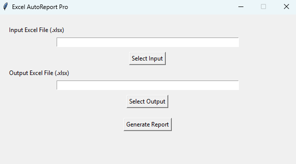
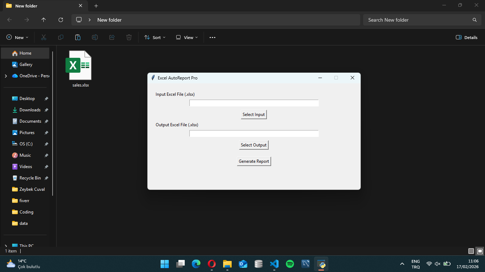
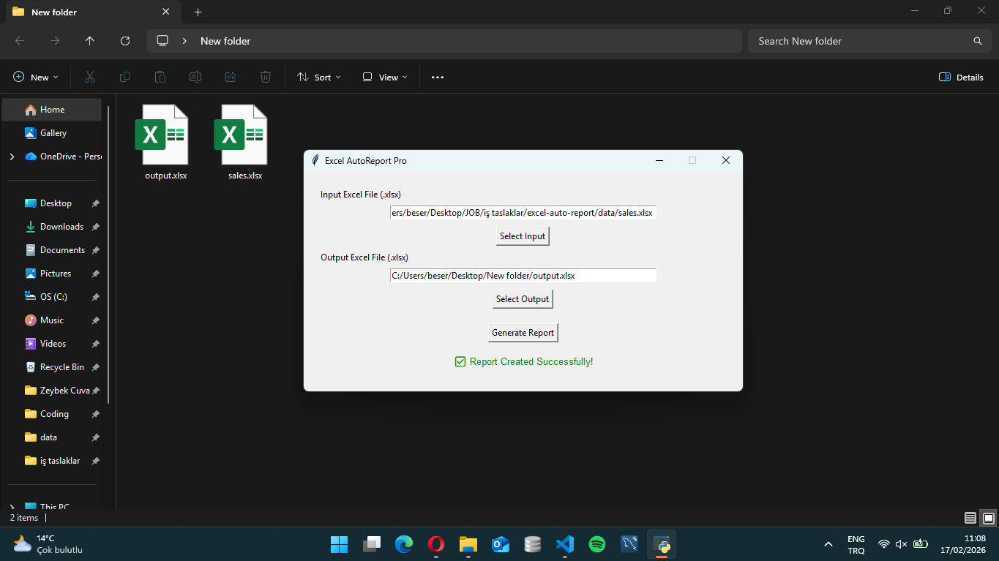
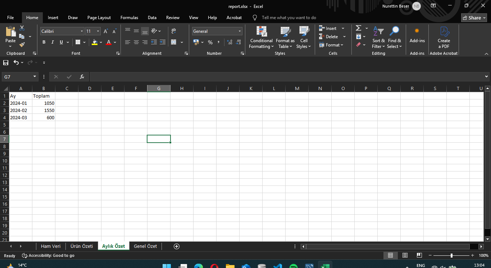
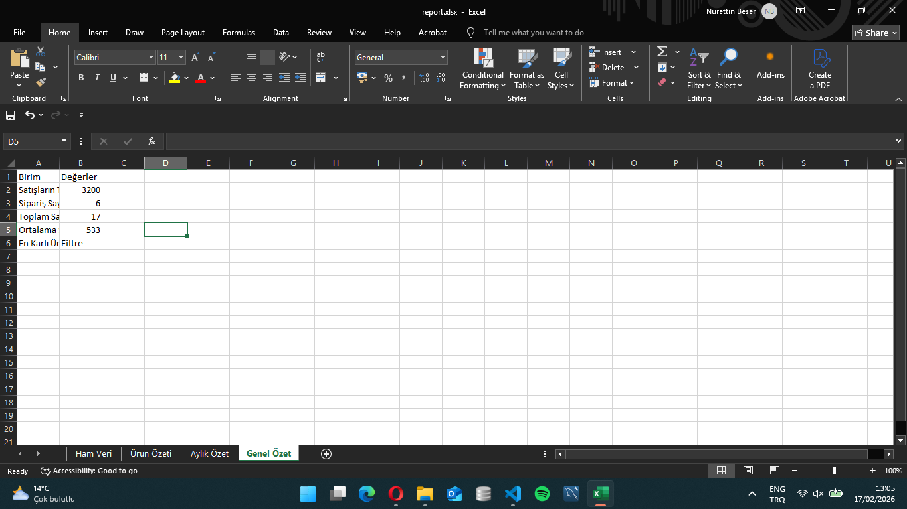
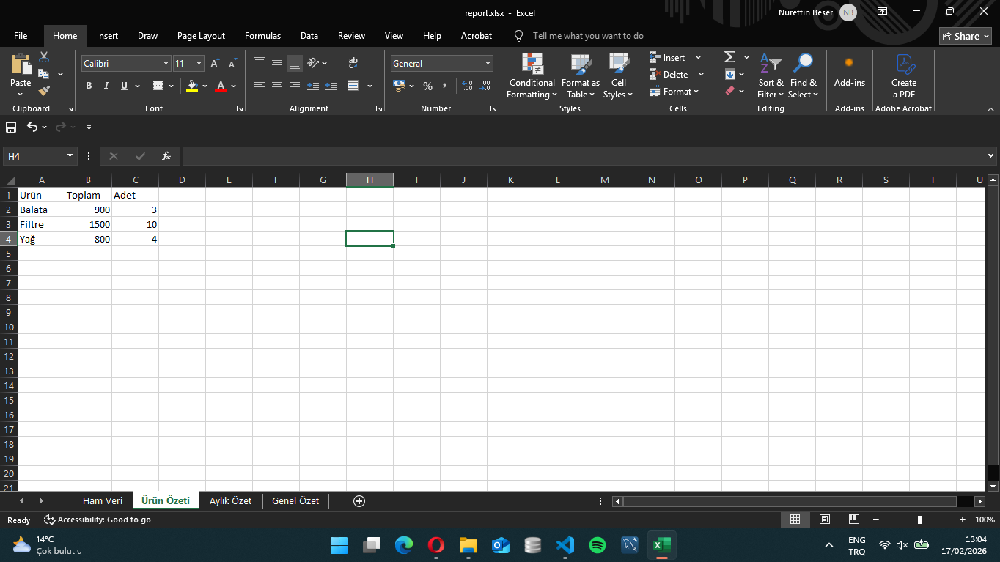

 

 

<!-- PROJECT LOGO -->
 

  

 

  <h3 align="center">Simple Excel Sales Report Generator</h3>

  

    Turn raw Excel sales data into a clean business summary in one click.
     
    

<!-- TABLE OF CONTENTS -->

  
Table of Contents

  <ol>
    <li>
      <a href="#about-the-project">About The Project</a>
      <ul>
        <li><a href="#built-with">Built With</a></li>
      </ul>
    </li>
    <li><a href="#features">Features</a></li>
    <li><a href="#demo">Demo</a></li>
   </ol>

<!-- ABOUT THE PROJECT -->
## About The Project

[![Product Name Screen Shot][product-screenshot]](image/logo.png)

This tool converts raw .xlsx sales data into:

A detailed processed report

A separate summary sheet with:

Total Revenue

Total Orders

Total Quantity Sold

Average Order Value

Best Customer

(<a href="#readme-top">back to top</a>)

### Built With

Python

(<a href="#readme-top">back to top</a>)

## Features

GUI-based report generation

CLI support

Automatic calculated columns

Automatic summary sheet

Clean Excel output

Windows executable available

(<a href="#readme-top">back to top</a>)

## Demo

Outputs

(<a href="#readme-top">back to top</a>)

<!-- CONTACT -->
## Contact

Nurettin Beşer - [https://www.instagram.com/zcodingsolutions/](https://www.instagram.com/zcodingsolutions/)

Project Link: [https://github.com/nbeser/SimpleExcelReportGenerator/](https://github.com/nbeser/SimpleExcelReportGenerator/)

(<a href="#readme-top">back to top</a>)

